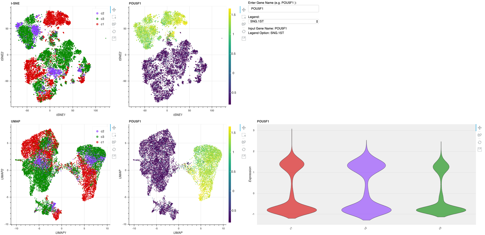

# scvis
**Interactive** Single Cell RNA-seq Data Visualization in web browser.

My colleagues would like to explore gene expression in cells. I'm too lazy and tired to generate new plots for each interest gene.
So, I setup a simplest web app using bokeh to help them. here is an example:




### Usage   

1. run the app
```bash
bokeh serve scBokeh
```
2. Enter gene names or select catogorical option to show.

### Dependency

* python >3 
* bokeh
* colorect
* scanpy
* numpy
* scipy

### TODO
I did not find a good example to generate voilinplot in Bokeh server application. 
However, the amazing bokeh could do this easy!  
